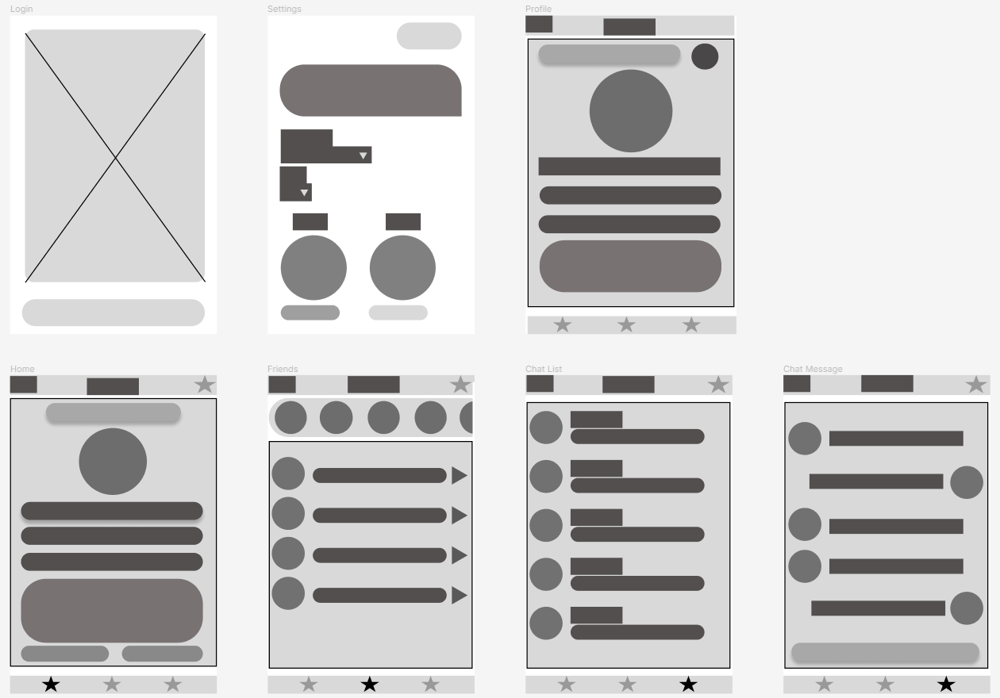
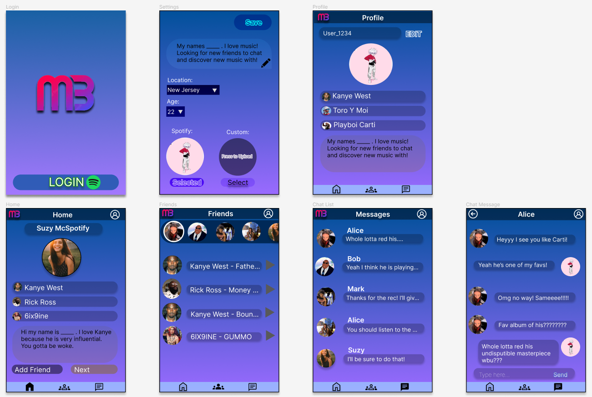

# Music Buddy

## Table of Contents
1. [Overview](#Overview)
1. [Product Spec](#Product-Spec)
1. [Wireframes](#Wireframes)
2. [Schema](#Schema)

## Overview
	Music Buddy is a social networking app designed to help users find and make friends based on their music taste!

### Description
	Music Buddy utilizes Spotify API to analyze user data and connect users based on similar music taste. 


### App Evaluation
- **Category: Social/Music**
- **Mobile: Android**
- **Story: Make friends through music**
- **Market: Social media users**
- **Habit: Match, and get to know more users with the same music taste**
- **Scope: Create an app which allows users to create new connections, chat with friends, and see what artists their friends are listening to**

## Product Spec

### 1. User Stories (Required and Optional)

**Required Must-have Stories**
* User must be able to login with Oauth Spotify
* User can see potential new matches in the main feed with the option to add or decline
* Have a friends page with people matched 
* User can see friends’s top 3 artist
* Have a Profile page showing more details about the user
* Have a chat list with displaying a list of friends
* Users are able to chat with friends they have matched with 
* Settings page where they can set their bio, approximate location, and age

**Optional Nice-to-have Stories**
* More detailed location setting
* Have notifications for new messages
* Matched friends are sorted by unmet first
* Add activity to see trending artists/songs and which friends are listening  
* Listen along with friends if they are listening to something currently
* User can set their own profile picture instead of their spotify one in their preferences
* User can log out
* Have Sync chat
* Open youtube videos inside chat


### 2. Screen Archetypes

* Login
   * User must be able to login with Oauth Spotify
* Home
   * User can see potential new matches in the main feed with the option to add or decline
* Friends
   * Have a friends page with people matched 
   * User can see friends’s top 3 artist
   * [Optional] Add activity to see trending artists/songs and which friends are listening
   * [Optional] Listen along with friends if they are listening to something currently
* Profile
   * Have a Profile page showing more details about the user
   * [Optional] User can log out
* Settings
   *  Settings page where they can set their bio, approximate location, and age
   * [Optional] More detailed location setting
   * [Optional] User can set their own profile picture instead of their spotify one in their preferences
* Chat list
   * Have a chat list with displaying a list of friends
   * [Optional] Matched friends are sorted by unmet first
* Chat Message
   * Users are able to chat with friends they have matched with 
   * [Optional] Have notifications for new messages
   * [Optional] Have Sync chat
   * [Optional] Open youtube videos inside chat

### 3. Navigation

**Tab Navigation** (Tab to Screen)
* Home
* Friends
* Chat List

** Flow Navigation** (Screen to Screen)
* Login
	* Preferences
	* Home
* Friends 
	* Profile
	* Chat Message
* Chat List
	* Chat Message
* Profile
	* Settings

## Wireframes
### Low Fidelity Wireframe


### High Fidelity Wireframe


### Interactive Prototype


GIF created with [LiceCap](http://www.cockos.com/licecap/).

## Schema 
### Models
#### User
  | Property          | Type     | Description |
   | -------------       | -------- | ------------|
   | userID            | int       | unique id for the user (default field and auto) |
   | username      | String  | name the user chooses from spotify or create in the app when first sign in|
   | userAge        | int        | user age |
   | location         | String   | the state where the user is located|
   | profilePic       | File      | user profile pic from spotify or uploaded himself/herself|
   | profileDescription  | String   | User bio/description |
   | invites           | User[] (array of userID)  | invites an user has |  
   | friends           | User[] (array of userID)  | friends an user has |  
   | createdAt      | DateTime     | date when User is created (default field) |
   | lastSwiped    | int               |  Highest userID seen |

#### userChat
| Property      | Type     | Description |
   | ------------- | -------- | ------------|
   | objectId      | int    | unique id for conversations (default increasing)|
   | userId1    | int| this is the id of the user that is going to send the message  |
   | userId2  | int| this is the id of the user that is going to get the message |
   | chat  | String| this is the actual content of the chat (for example 'hi, how are you') |
   | createdAt    | DateTime | date when User is created (default field) |


### Networking
#### List of network requests by screen
   - Home
		- (Read/Get) Query last swiped
			 ```java
			val query = ParseQuery<ParseObject>("Profile")
			query.whereMatches("userID")
			query.selectKeys(java.util.List.of("lastSwiped"))
			query.findInBackground { objects: List<ParseObject>, e: ParseException? ->
				if (e == null) {
					Log.d(Companion.TAG, "Objects: $objects")
					Log.d(Companion.TAG, "Object name: " + objects[0]["lastSwiped"])
				} else {
					Log.e(Companion.TAG, "Parse Error: ", e)
				}
			}

			```
		- (Create/Post) Add userID in User invite array
			 ```java
			val query = ParseQuery<ParseObject>("Profile")
			query.whereMatches("userID")
			query.selectKeys(java.util.List.of("invites"))
			query.adddInvite(otherUserID)
			query.saveInBackground { objects: List<ParseObject>, e: ParseException? ->
				if (e == null) {
					Log.d(Companion.TAG, "Objects: $objects")
					Log.d(Companion.TAG, "Object name: " + objects[0]["invites"])
					
				} else {
					Log.e(Companion.TAG, "Parse Error: ", e)
				}
			}
			```
		- (Create/Post) Remove userID in User invite array
			 ```java
			val query = ParseQuery<ParseObject>("Profile")
			query.whereMatches("userID")
			query.selectKeys(java.util.List.of("invites"))
			query.removeInvite(otherUserID)
			query.saveInBackground { objects: List<ParseObject>, e: ParseException? ->
				if (e == null) {
					Log.d(Companion.TAG, "Objects: $objects")
					Log.d(Companion.TAG, "Object name: " + objects[0]["invites"])
					
				} else {
					Log.e(Companion.TAG, "Parse Error: ", e)
				}
			}
			```
		- (Create/Post) Add userID in User friends array
			```java
			val query = ParseQuery<ParseObject>("Profile")
			query.whereMatches("userID")
			query.selectKeys(java.util.List.of("friends"))
			query.addFriend(otherUserID)
			query.saveInBackground { objects: List<ParseObject>, e: ParseException? ->
				if (e == null) {
					Log.d(Companion.TAG, "Objects: $objects")
					Log.d(Companion.TAG, "Object name: " + objects[0]["friends"])
					
				} else {
					Log.e(Companion.TAG, "Parse Error: ", e)
				}
			}
			```
									
   - Settings
		- (Read/Get) Create picture for profile
			 ```java
			val query = ParseQuery<ParseObject>("Profile")
			query.whereMatches("userID")
			query.selectKeys(java.util.List.of("profilePic"))
			query.setPicture(picture)
			query.saveInBackground { objects: List<ParseObject>, e: ParseException? ->
				if (e == null) {
					Log.d(Companion.TAG, "Objects: $objects")
					Log.d(Companion.TAG, "Object name: " + objects[0]["profilePic"])
					
				} else {
					Log.e(Companion.TAG, "Parse Error: ", e)
				}
			}
			```
		- (Create/POST) Create description for profile
			 ```java
			val query = ParseQuery<ParseObject>("Profile")
			query.whereMatches("userID")
			query.selectKeys(java.util.List.of("profileDescription"))
			query.setDescription(description)
			query.saveInBackground { objects: List<ParseObject>, e: ParseException? ->
				if (e == null) {
					Log.d(Companion.TAG, "Objects: $objects")
					Log.d(Companion.TAG, "Object name: " + objects[0]["profileDescription"])
					
				} else {
					Log.e(Companion.TAG, "Parse Error: ", e)
				}
			}
			 ```
   - Profile
		- (Read/Get) Query user description
			 ```java
			val query = ParseQuery<ParseObject>("Profile")
			query.whereMatches("userID")
			query.selectKeys(java.util.List.of("profileDescription"))
			query.findInBackground { objects: List<ParseObject>, e: ParseException? ->
				if (e == null) {
					Log.d(Companion.TAG, "Objects: $objects")
					Log.d(Companion.TAG, "Object name: " + objects[0]["profileDescription"])
				} else {
					Log.e(Companion.TAG, "Parse Error: ", e)
				}
			}
			```
		- (Read/Get) Create picture for profile
			 ```java
			val query = ParseQuery<ParseObject>("Profile")
			query.whereMatches("userID")
			query.selectKeys(java.util.List.of("profilePic"))
			query.setPicture(picture)
			query.saveInBackground { objects: List<ParseObject>, e: ParseException? ->
				if (e == null) {
					Log.d(Companion.TAG, "Objects: $objects")
					Log.d(Companion.TAG, "Object name: " + objects[0]["profilePic"])
					
				} else {
					Log.e(Companion.TAG, "Parse Error: ", e)
				}
			}
			```
		- (Read/Get) Query username
			 ```java
			val query = ParseQuery<ParseObject>("Profile")
			query.whereMatches("userID")
			query.selectKeys(java.util.List.of("useername"))
			query.findInBackground { objects: List<ParseObject>, e: ParseException? ->
				if (e == null) {
					Log.d(Companion.TAG, "Objects: $objects")
					Log.d(Companion.TAG, "Object name: " + objects[0]["username"])
				} else {
					Log.e(Companion.TAG, "Parse Error: ", e)
				}
			}
			```
   - Friends
		- (Read/Get) List of users friends
			 ```java
			val query = ParseQuery<ParseObject>("Profile")
			query.whereMatches("userID")
			query.selectKeys(java.util.List.of("friends"))
			query.findInBackground { objects: List<ParseObject>, e: ParseException? ->
				if (e == null) {
					Log.d(Companion.TAG, "Objects: $objects")
					Log.d(Companion.TAG, "Object name: " + objects[0]["friends"])
				} else {
					Log.e(Companion.TAG, "Parse Error: ", e)
				}
			}
			```
   - Chat List
		- (Read/Get) List of friends
			 ```java
			val query = ParseQuery<ParseObject>("Profile")
			query.whereMatches("userID")
			query.selectKeys(java.util.List.of("friends"))
			query.findInBackground { objects: List<ParseObject>, e: ParseException? ->
				if (e == null) {
					Log.d(Companion.TAG, "Objects: $objects")
					Log.d(Companion.TAG, "Object name: " + objects[0]["friends"])
				} else {
					Log.e(Companion.TAG, "Parse Error: ", e)
				}
			}
			```
		- (Read/Get) Query username
			 ```java
			val query = ParseQuery<ParseObject>("Profile")
			query.whereMatches("userID")
			query.selectKeys(java.util.List.of("username"))
			query.findInBackground { objects: List<ParseObject>, e: ParseException? ->
				if (e == null) {
					Log.d(Companion.TAG, "Objects: $objects")
					Log.d(Companion.TAG, "Object name: " + objects[0]["username"])
				} else {
					Log.e(Companion.TAG, "Parse Error: ", e)
				}
			}
			```
		- (Read/Get) Query pic
			 ```java
			val query = ParseQuery<ParseObject>("Profile")
			query.whereMatches("userID")
			query.selectKeys(java.util.List.of("profilePic"))
			query.findInBackground { objects: List<ParseObject>, e: ParseException? ->
				if (e == null) {
					Log.d(Companion.TAG, "Objects: $objects")
					Log.d(Companion.TAG, "Object name: " + objects[0]["profilePic"])
				} else {
					Log.e(Companion.TAG, "Parse Error: ", e)
				}
			}
			```
   - Chat Message
		- (Read/Get) Query username
			 ```java
			val query = ParseQuery<ParseObject>("Profile")
			query.whereMatches("userID")
			query.selectKeys(java.util.List.of("username"))
			query.findInBackground { objects: List<ParseObject>, e: ParseException? ->
				if (e == null) {
					Log.d(Companion.TAG, "Objects: $objects")
					Log.d(Companion.TAG, "Object name: " + objects[0]["username"])
				} else {
					Log.e(Companion.TAG, "Parse Error: ", e)
				}
			}
			```
		- (Read/Get) Query chat messages
			 ```java
			val query = ParseQuery<ParseObject>("userChat")
			query.whereMatches("userID")
			query.whereMatches("friendID")
                        query.addDescendingOrder("objectId");
			query.findInBackground { objects: List<ParseObject>, e: ParseException? ->
				if (e == null) {
					Log.d(Companion.TAG, "Objects: $objects")
					Log.d(Companion.TAG, "Object name: " + objects[0]["chat"])
				} else {
					Log.e(Companion.TAG, "Parse Error: ", e)
				}
			}
			```
		- (Create/POST) Create new chat message
			 ```java
			val query = ParseQuery<ParseObject>("userChat")
			query.whereMatches("userID")
			query.whereMatches("friendID")
                      	query.setMessage(message)
			query.saveInBackground { objects: List<ParseObject>, e: ParseException? ->
				if (e == null) {
					Log.d(Companion.TAG, "Objects: $objects")
					Log.d(Companion.TAG, "Object name: " + objects[0]["chat"])
				} else {
					Log.e(Companion.TAG, "Parse Error: ", e)
				}
			}
			```	
#### API Endpoints
##### Spotify API
- Base URL - [https://api.spotify.com/v1](https://api.spotify.com/v1)

   HTTP Verb | Endpoint | Description
   ----------|----------|------------
    `GET`    | /me/top/type | Get User's Top Items
    `GET`    | /users/user_id  | Get User's Profile
    `GET`    | /me  | Get Current User's Profile
    `GET`    | me/player | Get Playback State
    `GET`    | me/following | Get Followed Artists
    `GET`    | me/following/contains | Check If User Follows Artists or Users
